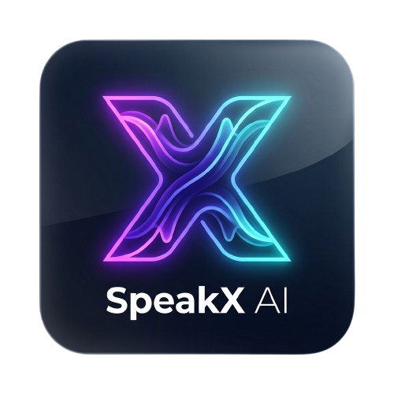

# SpeakX AI: Multi-Engine AI Text-To-Speech Studio

<p align="center">
  
</p>

<p align="center">
  <strong>SpeakX AI</strong> is a premium, studio-grade Text-to-Speech (TTS) workspace integrating four industry-leading voice synthesis engines: <strong>ElevenLabs</strong>, <strong>OpenAI TTS</strong>, <strong>Microsoft Azure AI Speech</strong>, and <strong>Sarvam AI</strong>.
</p>

<p align="center">
  <a href="#-quick-deploy-to-vercel">Vercel Deployment</a> •
  <a href="#-features">Features</a> •
  <a href="#-project-architecture">Architecture</a> •
  <a href="#-setup--installation">Setup & Install</a> •
  <a href="#-engine-comparison--pricing">Pricing & Engines</a>
</p>

---

## 🚀 Features

### 1. ElevenLabs Studio (Premium Voices & SFX)
* **Safe-List Premade Voices**: Preset with verified voices (*Sarah, Roger, Laura, Charlie, George, Callum, River*) preventing billing validation barriers.
* **Sound Effects Generator (SFX)**: Cinematic sound effect generation with customizable duration.
* **Voice Customization**: Real-time tuning for *Stability*, *Clarity / Similarity Boost*, and *Style Exaggeration*.
* **Dynamic Model Switching**: Instant toggling between *Eleven Multilingual v2* and *Eleven English v2*.

### 2. OpenAI TTS Studio
* **Native API Speed Control**: Granular speed sliders (0.25x - 4.00x) applied directly via OpenAI API parameters for natural prosody without electronic pitch warping.
* **Multi-Format Export**: Stream audio in **MP3, Opus, AAC, FLAC, WAV, or PCM** formats.
* **High-Definition Models**: Support for both `tts-1` (real-time low latency) and `tts-1-hd` (studio-grade quality).
* **Preset Voices**: Full support for *Alloy, Echo, Fable, Onyx, Nova, and Shimmer*.

### 3. Sarvam AI Studio (Indic Language Specialist)
* **Indic-Optimized Synthesis**: Powered by the cutting-edge `bulbul:v3` model.
* **11 Regional Indic Languages**: Comprehensive native accent & phoneme support for Hindi (`hi-IN`), Indian English (`en-IN`), Bengali (`bn-IN`), Tamil (`ta-IN`), Telugu (`te-IN`), Marathi (`mr-IN`), Gujarati (`gu-IN`), Punjabi (`pa-IN`), Odia (`or-IN`), Kannada (`kn-IN`), and Malayalam (`ml-IN`).
* **Expressive Speakers**: Optimized speakers such as *Shubh* & *Shreya* (Hindi) and *Ratan* & *Ishita* (English).
* **Native Pace Modulation**: Direct API parameter adjustments (0.5x - 2.0x).

### 4. Microsoft Azure Neural Speech
* **Neural Cloud Voices**: Instant synthesis with Azure Neural characters (*Jenny, Guy, Aria, Sonia, Ryan*).
* **Datacenter Region Selector**: Direct endpoint regional selection (e.g. `eastus`, `westus2`, `southeastasia`).

### 5. Studio Productivity & Storage
* **IndexedDB Local Audio Library**: Automatically stores generated audio blobs directly in the browser's persistent IndexedDB cache without storage limits.
* **Direct Audio Downloads**: Export generated tracks formatted with their respective extensions (`.mp3`, `.wav`, `.aac`, `.flac`, etc.).
* **Dynamic Waveform Visualizer**: Live playback wave animation indicator.
* **Responsive Single-Column Design**: Glassmorphism aesthetic, sleek dark mode, and responsive layout.

---

## 🌐 Quick Deploy to Vercel

You can deploy the **SpeakX AI** frontend to Vercel in just a few clicks:

1. **Push your repository** to GitHub or GitLab.
2. In the [Vercel Dashboard](https://vercel.com/new), click **Add New Project** and import this repository.
3. Configure the **Build & Development Settings**:
   * **Root Directory**: `frontend`
   * **Framework Preset**: `Vite`
   * **Build Command**: `npm run build`
   * **Output Directory**: `dist`
4. Add your **Environment Variables** in the Vercel project settings:
   * `VITE_OPENAI_API_KEY` = `your_openai_api_key`
   * `VITE_ELEVENLABS_API_KEY` = `your_elevenlabs_api_key`
   * `VITE_BACKEND_URL` = *(Optional: URL of deployed backend gateway for Sarvam AI)*
5. Click **Deploy**. Your app will be live at `https://speakxai.vercel.app` (or your chosen project name)!

---

## 🛠️ Project Architecture

SpeakX AI uses a modular layout separating frontend components, client-side caching, API gateways, and regional proxy services:

```
speakx-ai/
├── frontend/                     # React 19 + Vite 8 Frontend Studio
│   ├── public/                   # Static assets & icons
│   │   ├── speakxai-logo.png     # Full SpeakX AI Studio Brand Logo
│   │   ├── favicon.png           # 512x512 PNG Favicon
│   │   ├── favicon-192.png       # 192x192 Web App Icon
│   │   ├── favicon-32.png        # 32x32 Browser Tab Icon
│   │   └── apple-touch-icon.png  # Apple Touch Icon
│   ├── src/
│   │   ├── components/
│   │   │   └── controls/         # Studio engine controls
│   │   │       ├── AzureControls.jsx
│   │   │       ├── ElevenLabsControls.jsx
│   │   │       ├── OpenAIControls.jsx
│   │   │       └── SarvamControls.jsx
│   │   ├── services/
│   │   │   ├── audioStorage.js   # IndexedDB persistent audio cache
│   │   │   └── ttsService.js     # Unified TTS API abstraction layer
│   │   ├── styles/
│   │   │   ├── App.css           # Studio styling & micro-animations
│   │   │   └── index.css         # Theme tokens & typography
│   │   ├── App.jsx               # Main SpeakX AI Workspace component
│   │   ├── index.html            # Entry HTML with meta & brand icons
│   │   └── main.jsx              # React mounting root
│   ├── .env                      # Private frontend credentials (Gitignored)
│   └── package.json              # Frontend scripts & dependencies
├── backend/                      # Node.js + Express API Gateway
│   ├── controllers/              # Route controller logic
│   │   └── ttsController.js      # Business logic to talk to Sarvam SDK
│   ├── routes/                   # Routing configuration middleware
│   │   └── ttsRoutes.js          # /tts/sarvam endpoint mapping
│   ├── index.js                  # Express entry point
│   ├── .env                      # Private backend keys (Gitignored)
│   └── package.json              # Backend scripts & dependency lock
├── package.json                  # Root monorepo workspace launcher
└── README.md                     # Studio Documentation
```

---

## ⚙️ Setup & Installation

### 1. Configure Credentials

#### Frontend Credentials
Create or edit `.env` in `frontend/`:

```env
# Path: frontend/.env
VITE_OPENAI_API_KEY=your_openai_api_key_here
VITE_ELEVENLABS_API_KEY=your_elevenlabs_api_key_here
```

#### Backend Credentials
Create or edit `.env` in `backend/`:

```env
# Path: backend/.env
PORT=5001
SARVAM_API_KEY=your_sarvam_api_key_here
```

*Note: Environment files (`.env`) are git-ignored to prevent leaking credentials.*

### 2. Run the Studio Locally

```bash
# 1. Install dependencies in frontend and backend
cd frontend && npm install
cd ../backend && npm install

# 2. Run frontend development server
cd ../frontend && npm run dev
```

* **Frontend Studio**: [http://localhost:5173](http://localhost:5173)
* **Backend Gateway**: [http://localhost:5001](http://localhost:5001)

---

## ⚡ Engine Comparison & Pricing

| Provider | Model / Focus | Pricing (Per 1 Million Characters) | Key Strengths |
| :--- | :--- | :--- | :--- |
| **ElevenLabs** | Multilingual v2 / SFX | **$110.00 – $300.00** | Ultra-realistic emotional inflection, cinematic SFX |
| **OpenAI TTS** | `tts-1` & `tts-1-hd` | **$15.00** (Std) / **$30.00** (HD) | Crystal-clear narration, multiple formats (FLAC/WAV/AAC) |
| **Sarvam AI** | `bulbul:v3` | **Pay-As-You-Go** | Industry-best Indian accent & 11 Indic languages |
| **Azure Speech**| Neural Voice Suite | **$16.00** (Neural) | Low latency, enterprise reliability & datacenter control |

---

## 📄 License
MIT © 2026 SpeakX AI Studio.
